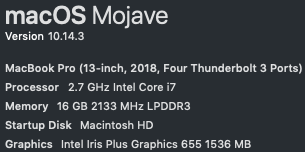

# Go SQL Demo

CLI to write/read from a postgres database using differnt libraries

Presented during [Serveriders meetup](https://www.meetup.com/serversiders/) on Feb 26th 2019

## Tools used

- Go 1.11.2 
- Docker Engine 18.09.2
- postgres:9.6.9 docker image
- dep 0.5.0

## Libraries

- stdlib [database/sql](https://golang.org/pkg/database/sql/) 
- [sqlx](https://github.com/jmoiron/sqlx)
- ORM [go-pg](https://github.com/go-pg/pg)

## Useful docs and examples
- [SQLInterface](https://github.com/golang/go/wiki/SQLInterface)
- [Illustrated guide to SQLX](http://jmoiron.github.io/sqlx/)
- [go-pg writing queries](https://github.com/go-pg/pg/wiki/Writing-Queries)


## Running the demo

Default environment 

```sh
    DB_HOST=localhost
    DB_PORT=5000
    DB_NAME=postgres
    DB_USER=postgres
    DB_PASS=postgres
```

### DB

make commands available:

```sh
    db # creates container and starts it
    db_new #Remove DB docker container and start a new one:
    db_start # stats existing container
    db_clean # deletes container
    db_logs # livetail db logs
```

### migrations

DB must be running on DB_PORT

```sh
    make migrations
```

### Demo

```sh
    make run
```

### unit tests

```sh
    make test
```

### benchmark

```sh
    make bench
```

**benchmark results**



```sh
   GOCACHE=off go test ./pkg/demo/ -bench=. -benchmem
    goos: darwin
    goarch: amd64
    pkg: github.com/jaimem88/go-sql-demo/pkg/demo
    BenchmarkMain-8                	       1	7454721759 ns/op	   58736 B/op	     590 allocs/op
    BenchmarkSQLGenData2-8         	2000000000	         0.00 ns/op	       0 B/op	       0 allocs/op
    BenchmarkSQLGenData10-8        	2000000000	         0.02 ns/op	       0 B/op	       0 allocs/op
    BenchmarkSQLGenData100-8       	2000000000	         0.16 ns/op	       0 B/op	       0 allocs/op
    BenchmarkSQLGenData500-8       	       1	1653197540 ns/op	 1805320 B/op	   42005 allocs/op
    BenchmarkSQLGenData1000-8      	       1	3947097206 ns/op	 3609336 B/op	   84005 allocs/op
    BenchmarkSQLGenData10000-8     	       1	32426111455 ns/op	36097000 B/op	  840063 allocs/op
    BenchmarkSQLXGenData2-8        	2000000000	         0.00 ns/op	       0 B/op	       0 allocs/op
    BenchmarkSQLXGenData10-8       	2000000000	         0.01 ns/op	       0 B/op	       0 allocs/op
    BenchmarkSQLXGenData100-8      	2000000000	         0.15 ns/op	       0 B/op	       0 allocs/op
    BenchmarkSQLXGenData500-8      	       1	1651086577 ns/op	 2633320 B/op	   58005 allocs/op
    BenchmarkSQLXGenData1000-8     	       1	3522204668 ns/op	 5266928 B/op	  116013 allocs/op
    BenchmarkSQLXGenData10000-8    	       1	34453253108 ns/op	52660920 B/op	 1160087 allocs/op
    BenchmarkGoPGGenData2-8        	2000000000	         0.00 ns/op	       0 B/op	       0 allocs/op
    BenchmarkGoPGGenData10-8       	1000000000	         0.02 ns/op	       0 B/op	       0 allocs/op
    BenchmarkGoPGGenData100-8      	2000000000	         0.10 ns/op	       0 B/op	       0 allocs/op
    BenchmarkGoPGGenData500-8      	       1	1102782870 ns/op	 1153320 B/op	   25005 allocs/op
    BenchmarkGoPGGenData1000-8     	       1	2370146582 ns/op	 2305320 B/op	   50005 allocs/op
    BenchmarkGoPGGenData10000-8    	       1	22033134184 ns/op	23051880 B/op	  500045 allocs/op
    BenchmarkSQLGetAllUsersSQL-8   	1000000000	         0.24 ns/op	       0 B/op	       0 allocs/op
    BenchmarkSQLXGetAllUsers-8     	2000000000	         0.09 ns/op	       0 B/op	       0 allocs/op
    BenchmarkGoPGGetAllUsers-8     	2000000000	         0.10 ns/op	       0 B/op	       0 allocs/op
    PASS
    ok  	github.com/jaimem88/go-sql-demo/pkg/demo	129.515s 
```
